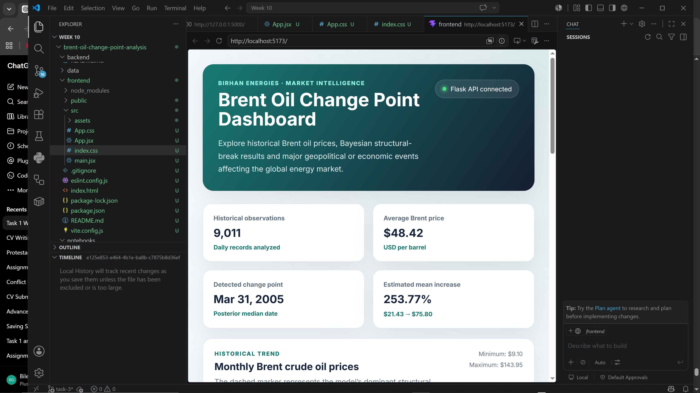
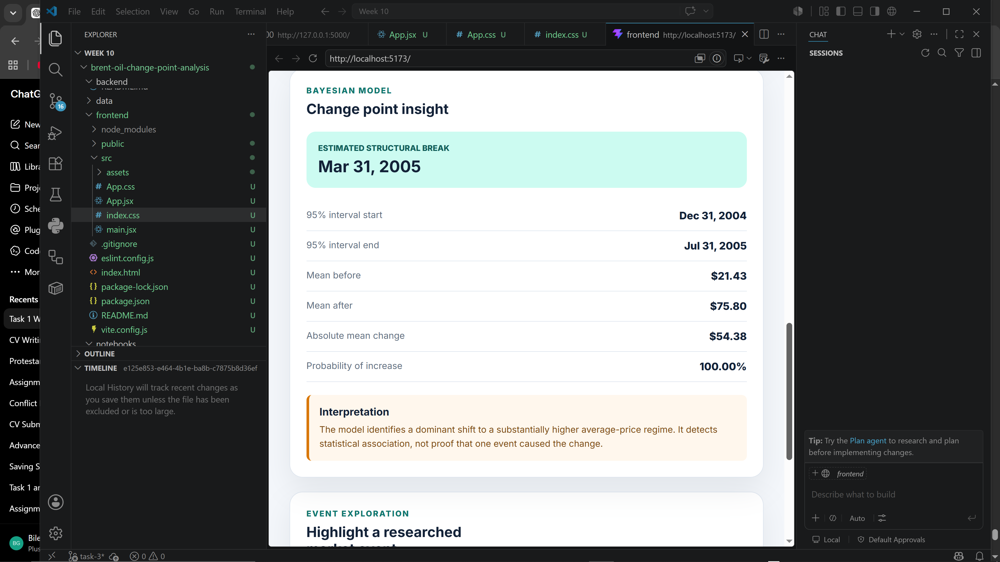

# Brent Oil Change Point Analysis

## Project Overview

This project investigates structural changes in historical Brent crude oil
prices and examines whether detected changes align with major geopolitical,
economic, and oil-market events.

The analysis is developed for Birhan Energies to support investors,
policymakers, and energy companies in understanding oil price instability and
making data-informed decisions.

## Business Objective

The main objectives are to:

1. Examine historical trends and volatility in Brent oil prices.
2. Identify statistically significant structural changes in the price series.
3. Compare detected change points with major geopolitical, economic, and OPEC events.
4. Quantify changes in price behaviour before and after identified change points.
5. Communicate the results through a written report and interactive dashboard.

## Dataset

The project uses daily historical Brent crude oil prices expressed in US
dollars per barrel. The supplied dataset contains observations from May 1987
to November 2022.

## Project Structure

```text
├── .github/workflows/
├── .vscode/
├── data/
│   ├── raw/
│   ├── processed/
│   └── events/
├── notebooks/
├── reports/
│   └── figures/
├── scripts/
├── src/
├── tests/
├── .gitignore
├── README.md
└── requirements.txt

## Task 1 Progress

Task 1 establishes the analytical foundation for the project.

Completed components include:

- Project and repository structure
- Raw data validation
- Structured dataset of major oil-market events
- Historical trend analysis
- Log-return calculation
- Stationarity testing
- Rolling volatility analysis
- Change point modeling plan
- Assumptions and limitations
- Discussion of temporal association versus causal evidence

## Important Data Note

The challenge document describes the dataset as ending in September 2022.
However, the supplied CSV contains observations through November 2022. This
project retains the complete supplied dataset and documents the difference.

## Structured Event Dataset

The repository contains a manually curated structured event dataset located at:

data/events/key_oil_market_events.csv

The dataset contains 17 historical events, including:

- OPEC production decisions
- Geopolitical conflicts
- Economic crises
- International sanctions
- Natural disasters
- COVID-19 pandemic
- Russia–Ukraine conflict

This dataset is used throughout the analysis to compare statistically detected change points with important historical events.

## Task 2 Results

A Bayesian one-change-point model was fitted to monthly average Brent oil
prices using PyMC.

Key outputs include:

- MCMC sampling with four chains
- R-hat and effective sample-size diagnostics
- Trace plots and posterior distributions
- Detection of a dominant structural break around March 2005
- Quantification of average prices before and after the change
- Comparison with the curated oil-market event dataset
- Explicit discussion of uncertainty, limitations, and causal interpretation

Generated model outputs are stored in:

- `data/processed/bayesian_change_point_results.csv`
- `data/processed/bayesian_change_point_summary.csv`
- `data/processed/event_association_results.csv`

Visualizations are stored in `reports/figures/`.

## Dashboard Screenshots

### Dashboard Overview


The dashboard presents historical Brent prices, key summary indicators, the
Bayesian change-point estimate, and before-and-after price statistics.

### Event Highlighting



Users can select a geopolitical, economic, or OPEC-related event to display
its date on the price chart and review its description, category, expected
market channel, and source.

### Date-Range Filtering



The dashboard supports custom start and end dates, allowing users to focus on
specific historical periods and market disruptions.

### Responsive Layout


The React interface adapts to narrower screens by stacking cards, charts, and
event details for tablet and mobile viewing.